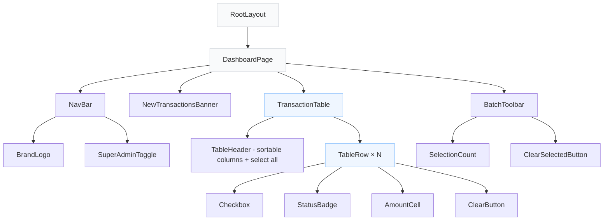
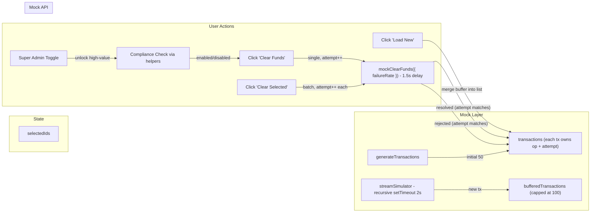
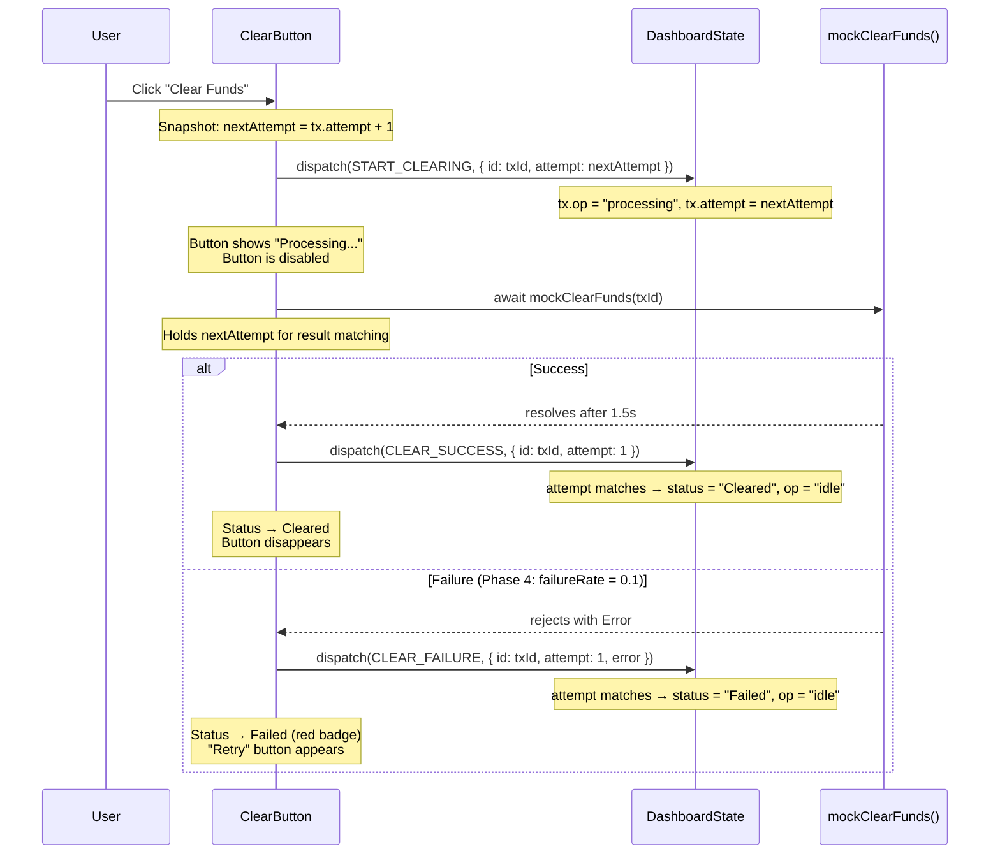
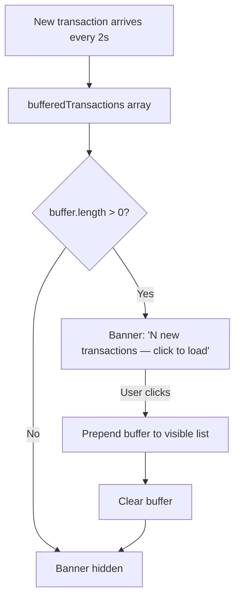
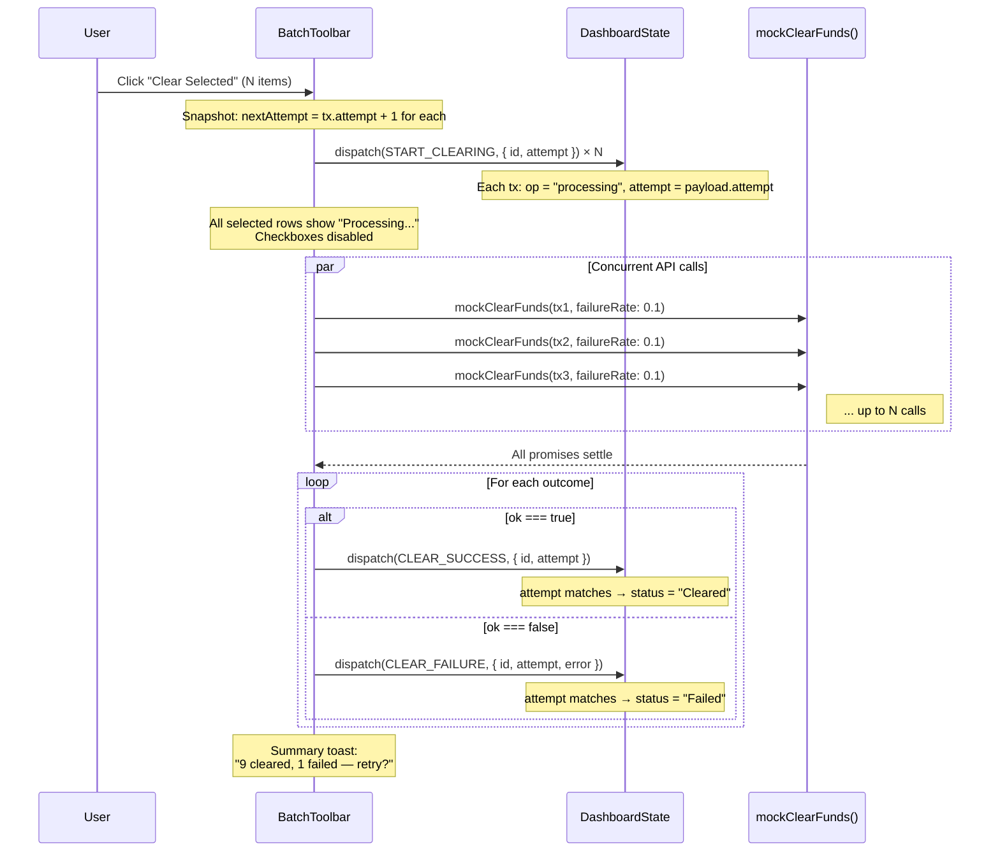

# Portola Ops Dashboard — Implementation Document

> Architectural blueprint, trade-off log, and phase-by-phase roadmap for the Portola Mission Control settlement dashboard.

---

## Table of Contents

0. [Non-Negotiable Correctness Rules](#0-non-negotiable-correctness-rules)
1. [Tech Stack Selection](#1-tech-stack-selection)
2. [Design System & Styling Direction](#2-design-system--styling-direction)
3. [Component Architecture](#3-component-architecture)
4. [Data Flow](#4-data-flow)
5. [Phase 1 — The MVP](#5-phase-1--the-mvp)
6. [Phase 2 — Compliance](#6-phase-2--compliance)
7. [Phase 3 — Live Fire](#7-phase-3--live-fire)
8. [Phase 4 — Batch Settlement](#8-phase-4--batch-settlement)
9. [Concurrency & Edge Cases](#9-concurrency--edge-cases)
10. [Testing Strategy](#10-testing-strategy)
11. [What We'd Improve With More Time](#11-what-wed-improve-with-more-time)

---

## 0. Non-Negotiable Correctness Rules

These invariants hold across every phase. Code that violates any of them is a bug.

| Rule | Why |
| ---- | --- |
| **Never shift rows during user actions** | Buffered banner merge only — the visible table is stable until the user explicitly loads new transactions. |
| **Never allow double clears** | The transaction's `op` field (+ attempt token) is the single source of truth. If `op === "processing"`, all clear triggers (button, checkbox, batch) are disabled for that row. |
| **Batch results are independent** | One rejection must never collapse the entire batch. `Promise.allSettled()` (or catch-per-promise) guarantees per-transaction outcomes. |
| **Compliance lock is enforced consistently** | A single set of pure helper predicates (`isHighValue`, `isLocked`, `canClear`, `canSelect`) gates every interaction — buttons, checkboxes, and batch eligibility all call the same functions. |
| **Row keys use `transaction.id` only** | Never use array index as a React key. Index-based keys cause UI state (processing spinners, checkbox ticks) to migrate to the wrong row when items are prepended or reordered. |
| **Attempt is computed from a pre-dispatch snapshot** | The handler reads `tx.attempt` from current state *before* calling `dispatch`, computes `next = prev + 1`, and passes it into `START_CLEARING`. Never read state after dispatch in the same call stack — React's batched updates make that a stale read. |
| **Reducer updates are ID-indexed** | For this exercise, `transactions.find(t => t.id === id)` is fine at ≤100 rows. If rows scale past ~1 000, we'd keep a `byId: Record<string, Transaction>` map for O(1) lookups and derive a sorted `ids: string[]` list for rendering. Even at current scale, the mental model is "lookup by ID, never by index." |

---

## 1. Tech Stack Selection

| Layer             | Choice                                | Rationale                                                                                                                                              |
| ----------------- | ------------------------------------- | ------------------------------------------------------------------------------------------------------------------------------------------------------ |
| **Framework**     | Next.js 14+ (App Router), TypeScript  | File-based routing, React Server Component potential, signals modern fluency. Matches the "React/Next.js" suggestion in the brief.                     |
| **Styling**       | Tailwind CSS                          | Utility-first approach enables rapid UI iteration. Easy to express Portola's muted palette (`gray-50`→`gray-900`, subtle borders, minimal accents).    |
| **State**         | React `useState` / `useReducer`       | Data is local and mock — a global store (Redux, Zustand) is over-engineering for ≤100 rows. `useReducer` shines once batch + streaming state interact. |
| **Table**         | Hand-rolled `<table>` with semantics  | For 50–100 rows a custom `<table>` is simpler, lighter, and demonstrates DOM understanding. TanStack Table would be warranted at 1 000+ rows with virtualization, server-side pagination, or complex column pinning — none of which apply here. |
| **Mock Data**     | Hand-rolled generator utility         | Avoids a `faker` dependency for a small, deterministic dataset. Weighted distribution (70 % small / 30 % institutional) matches the brief's realism note. |

### Tradeoff: `useState` vs. Global Store

A global store (Redux Toolkit, Zustand) gives us devtools time-travel and easier cross-component access. But the entire dashboard lives in a single route with co-located state; prop-drilling depth is ≤2. Adding a store would increase bundle size and ceremony for zero practical gain. If the app grew to multiple routes sharing transaction state, we'd revisit.

### Tradeoff: Hand-rolled Table vs. TanStack Table

TanStack Table provides headless primitives for sorting, filtering, pagination, and column resizing. It excels when requirements demand all of the above simultaneously. Our table needs only sorting and status badges — features achievable in ~30 lines of comparator logic. Shipping a hand-rolled table here shows we understand the underlying semantics (`<thead>`, `<tbody>`, `scope` attributes) rather than hiding behind an abstraction.

---

## 2. Design System & Styling Direction

Referencing Portola's brand: clean sans-serif typography, monochrome palette with subtle accent colors, generous whitespace, thin borders, softly rounded containers.

### Typography

- **Primary font**: Inter (loaded via `next/font/google`) — clean, highly legible at small sizes, perfect for data-dense tables.
- **Fallback**: system font stack (`-apple-system, BlinkMacSystemFont, "Segoe UI", Roboto, sans-serif`).
- **Scale**: 14 px body, 12 px table cells, 20 px page title, monospace for amounts/IDs.

### Color Palette

| Token            | Hex         | Usage                                      |
| ---------------- | ----------- | ------------------------------------------ |
| `bg-primary`     | `#FAFAFA`   | Page background                            |
| `text-primary`   | `#111827`   | Body text                                  |
| `border-default` | `#E5E7EB`   | Table borders, card strokes                |
| `status-cleared` | `#10B981`   | Cleared badge background (green-500)       |
| `status-pending` | `#F59E0B`   | Pending badge background (amber-500)       |
| `status-failed`  | `#EF4444`   | Failed badge / high-value row tint (red-500) |
| `accent-blue`    | `#3B82F6`   | Primary action buttons                     |
| `surface-card`   | `#FFFFFF`   | Card/container backgrounds                 |

### Component Tokens

- **Cards**: `bg-white rounded-lg shadow-sm border border-gray-200 p-6`
- **Status badges**: Pill-shaped (`rounded-full px-2.5 py-0.5 text-xs font-medium`) with status-specific `bg` and `text` colors.
- **Buttons**: `rounded-md px-3 py-1.5 text-sm font-medium` with `hover:` and `disabled:opacity-50 disabled:cursor-not-allowed` states.
- **High-value rows**: `bg-red-50 border-l-4 border-l-red-400` — never relying on color alone (see accessibility note in Phase 2).

### Layout

- Full-width centered container: `max-w-7xl mx-auto px-4 sm:px-6 lg:px-8`
- Top nav bar: "Portola Mission Control" branding left-aligned, Super Admin toggle right-aligned.
- Single-column dashboard below the nav.

---

## 3. Component Architecture



### Component Responsibilities

| Component                | Responsibility                                                                 |
| ------------------------ | ------------------------------------------------------------------------------ |
| `DashboardPage`          | Top-level state owner via `useReducer`: `transactions`, `bufferedTransactions`, `selectedIds`, `isSuperAdmin`, `sortConfig`. Each transaction owns its own `op` and `attempt` — no separate processing set. |
| `NavBar`                 | Branding + Super Admin toggle.                                                 |
| `NewTransactionsBanner`  | Shows "N new transactions — click to load" when buffered count > 0.            |
| `BatchToolbar`           | Appears when `selectedIds.size > 0`. Contains "Clear Selected" button.         |
| `TransactionTable`       | Renders `<table>` with sortable headers and maps over visible transactions.    |
| `TableRow`               | Single transaction row. Renders purely from the `Transaction` object + `isSuperAdmin`. Uses eligibility helpers to gate interactions. Keyed by `transaction.id` (never array index). |
| `StatusBadge`            | Stateless pill component driven by `status` prop.                              |
| `ClearButton`            | Handles click → calls `onClear(id)`, shows "Processing..." while in flight.   |
| `SuperAdminToggle`       | Controlled toggle; drives `isSuperAdmin` state.                                |

### Eligibility Helpers (Pure Functions)

All UI gating logic — which buttons are enabled, which checkboxes are interactive, which rows are flagged — flows through a single set of pure predicates in `lib/eligibility.ts`. This prevents rule duplication across components and ensures the compliance lock is enforced consistently everywhere.

```typescript
export const isHighValue = (tx: Transaction): boolean =>
  tx.amount > 10_000;

export const isLocked = (tx: Transaction, isSuperAdmin: boolean): boolean =>
  isHighValue(tx) && !isSuperAdmin;

export const canClear = (tx: Transaction, isSuperAdmin: boolean): boolean =>
  tx.status === "Pending" && tx.op === "idle" && !isLocked(tx, isSuperAdmin);

export const canSelect = (tx: Transaction, isSuperAdmin: boolean): boolean =>
  tx.status === "Pending" && tx.op === "idle" && !isLocked(tx, isSuperAdmin);

export const isTableStable = (transactions: Transaction[]): boolean =>
  !transactions.some((tx) => tx.op === "processing");
```

Every component that gates an interaction (`ClearButton`, `Checkbox`, `BatchToolbar`, `NewTransactionsBanner`) imports and calls these helpers. The UI stays "dumb" — it receives a transaction and a boolean, never re-derives eligibility rules inline. `isTableStable` reads naturally at the call site: `disabled={!isTableStable(transactions)}`.

---

## 4. Data Flow

### State Shape

```typescript
type TxStatus = "Pending" | "Cleared" | "Failed";
type TxOpState = "idle" | "processing";

interface Transaction {
  id: string;
  clientName: string;
  amount: number;
  status: TxStatus;
  op: TxOpState;       // explicit UI operation state — replaces a separate processingIds Set
  attempt: number;     // monotonically increasing per tx; guards against stale async results
  error?: string;      // populated when status === "Failed" — surfaces in UI for retry affordance
  timestampMs: number; // epoch millis — safe for sorting, serialization, and RSC boundaries
}

interface DashboardState {
  transactions: Transaction[];        // visible, rendered list
  bufferedTransactions: Transaction[]; // from live feed, held until user clicks "Load New"
  selectedIds: Set<string>;
  isSuperAdmin: boolean;
  sortConfig: { key: keyof Transaction; direction: "asc" | "desc" } | null;
}
```

**Why no `processingIds` Set?** Keeping a parallel `Set<string>` alongside `status` is a drift risk — if a reducer path updates one but not the other, the row renders an impossible state. By co-locating `op` on the transaction object itself, every row renders purely from its own data and the reducer is the single writer. The `attempt` counter prevents a slow response from overwriting a newer state (see [§9.1](#91-stale-result-guard)).

**Why `timestampMs: number` instead of `Date`?** `Date` objects are mutable and lose type information across serialization boundaries (`JSON.stringify`, React Server Components, `localStorage`). An epoch number is sortable with a plain `<` comparison, serializes cleanly, and is formatted only at render time via `new Intl.DateTimeFormat(...)`.


### Data Flow Diagram



### Reducer Actions (Conceptual)

| Action                    | Payload                          | Effect                                                                              |
| ------------------------- | -------------------------------- | ----------------------------------------------------------------------------------- |
| `INIT_TRANSACTIONS`       | `Transaction[]`                  | Set initial 50 transactions (all with `op: "idle"`, `attempt: 0`).                  |
| `BUFFER_TRANSACTION`      | `Transaction`                    | Append to `bufferedTransactions`. If buffer exceeds cap (100), drop oldest to keep most-recent-first ordering. |
| `MERGE_BUFFERED`          | —                                | Prepend `bufferedTransactions` to `transactions`, clear buffer.                     |
| `START_CLEARING`          | `{ id, attempt }`                | Set `tx.op = "processing"`, set `tx.attempt = payload.attempt`. The handler computes `attempt` from a pre-dispatch snapshot (`prev + 1`) and passes it in — the reducer never auto-increments. This eliminates the "read-after-dispatch" race. |
| `CLEAR_SUCCESS`           | `{ id, attempt }`                | **Only if `attempt` matches current `tx.attempt`**: set `status = "Cleared"`, `op = "idle"`, remove from `selectedIds`. Stale responses are silently dropped. |
| `CLEAR_FAILURE`           | `{ id, attempt, error }`         | **Only if `attempt` matches**: set `status = "Failed"`, `op = "idle"`, populate `tx.error`. Row shows a "Retry" affordance. |
| `TOGGLE_SELECT`           | `string` (id)                    | Add/remove id from `selectedIds`.                                                   |
| `SELECT_ALL_PENDING`      | —                                | Select all eligible Pending transactions (uses shared `canSelect` helper).          |
| `DESELECT_ALL`            | —                                | Clear `selectedIds`.                                                                |
| `SET_SORT`                | `{ key, direction }`             | Update sort configuration; transactions re-sort on render.                          |
| `TOGGLE_SUPER_ADMIN`      | —                                | Flip `isSuperAdmin`.                                                                |

---

## 5. Phase 1 — The MVP

### 5.1 Mock Data Generation

A `generateTransactions()` utility produces 50 entries with a weighted distribution:

- **70 %** small retail transfers: $50–$1,000
- **30 %** institutional transfers: $10,000–$250,000

Each transaction gets:

- `id`: `TXN-` prefix + zero-padded incrementing number (e.g., `TXN-00001`).
- `clientName`: Drawn from a curated list of ~30 realistic company/person names (avoids `faker` dependency).
- `amount`: Randomly generated within the bucket range, rounded to 2 decimal places.
- `status`: Weighted — 60 % Pending, 30 % Cleared, 10 % Failed — so there's meaningful data in every state.
- `timestampMs`: Random epoch timestamp within the last 48 hours, sorted descending by default. Formatted at render time via `new Intl.DateTimeFormat(...)`.
- `op`: `"idle"` (initial state).
- `attempt`: `0` (no clear attempts yet).

### 5.2 Table Design

- **Columns**: Checkbox (Phase 4), ID, Client Name, Amount, Status, Timestamp, Actions.
- **Sorting**: Click column header to sort asc/desc. Active sort indicated by a small arrow icon. Comparators handle string, number, and date types.
- **Amount formatting**: `Intl.NumberFormat('en-US', { style: 'currency', currency: 'USD' })` — right-aligned, monospace font for column alignment.
- **Status badges**: Color-coded pills (green/amber/red) with text labels — never color-only.

### 5.3 Clear Funds Button

**Interaction flow:**



**Mock API implementation (configurable failure rate):**

```typescript
interface ClearOptions {
  failureRate?: number; // 0 for Phases 1–3, 0.1 for Phase 4
}

async function mockClearFunds(txId: string, { failureRate = 0 }: ClearOptions = {}): Promise<void> {
  return new Promise((resolve, reject) => {
    setTimeout(() => {
      if (failureRate > 0 && Math.random() < failureRate) {
        reject(new Error(`Settlement failed for ${txId}`));
      } else {
        resolve();
      }
    }, 1500);
  });
}
```

The `failureRate` parameter is `0` by default (Phases 1–3: always succeeds) and set to `0.1` when Phase 4 batch processing is active. This avoids burying Phase 4 logic inside a function used from Phase 1.

### 5.4 Tradeoff: Optimistic vs. Pessimistic UI

| Approach       | Pros                                     | Cons                                               |
| -------------- | ---------------------------------------- | -------------------------------------------------- |
| **Optimistic** | Instant perceived speed; feels snappy    | Risky for financial ops — user sees "Cleared" before confirmation |
| **Pessimistic**| Accurate state; user trusts what they see | 1.5s of "Processing..." feels slower               |

**Decision: Pessimistic.** This is a financial settlement tool. Showing a premature "Cleared" status that might revert is worse than a brief loading state. Trust and accuracy outweigh perceived speed in this domain.

---

## 6. Phase 2 — Compliance

### 6.1 High-Value Flag

Transactions with `amount > 10_000` receive:

- **Row styling**: `bg-red-50 border-l-4 border-l-red-400` — a soft red tint with a strong left border.
- **Icon indicator**: A shield/warning icon (`⚠️` or an SVG) appended to the amount cell — ensures the flag is perceivable without color vision.
- **Aria label**: `aria-label="High-value transaction"` on the row for screen readers.

**Accessibility note:** WCAG 2.1 SC 1.4.1 (Use of Color) requires that color is not the sole means of conveying information. The left border, icon, and aria-label satisfy this requirement.

### 6.2 The Lock

The "Clear Funds" button is disabled when the shared eligibility helper returns false:

```typescript
// Uses the shared predicate from lib/eligibility.ts
const locked = isLocked(transaction, isSuperAdmin);
const clearable = canClear(transaction, isSuperAdmin);
```

Disabled state styling: `opacity-50 cursor-not-allowed` with a tooltip: "Requires Super Admin to clear high-value transactions."

### 6.3 Super Admin Toggle

- **Position**: Right side of the NavBar, always visible.
- **Implementation**: A toggle switch component with clear ON/OFF labeling (not just a color change).
- **Default**: OFF. High-value transactions locked.
- **Visual states**: OFF = gray track; ON = blue track with "Super Admin: ON" text label.

### 6.4 Tradeoff: Client-Side Toggle vs. Server-Side RBAC

| Approach                | Pros                                              | Cons                                                   |
| ----------------------- | ------------------------------------------------- | ------------------------------------------------------ |
| **Client-side toggle**  | Simple, fast to implement, demonstrates the logic | Zero security — anyone can toggle it                   |
| **Server-side RBAC**    | Actually secure, audit-logged, role-based         | Requires auth infrastructure, out of scope for exercise|

**Decision: Client-side toggle** for the exercise. This is explicitly the requirement. In a production Portola environment, this would be a server-enforced permission check: the API would reject clear requests for high-value transactions unless the authenticated user has the `super_admin` role. The toggle demonstrates the conditional logic; the security layer would wrap around it.

---

## 7. Phase 3 — Live Fire

### 7.1 The Feed

A `useEffect` sets up a **recursive `setTimeout` loop** that generates one new transaction every ~2 seconds:

```typescript
useEffect(() => {
  let timeoutId: ReturnType<typeof setTimeout>;

  function tick() {
    const newTx = generateSingleTransaction();
    dispatch({ type: "BUFFER_TRANSACTION", payload: newTx });
    timeoutId = setTimeout(tick, 2000);
  }

  timeoutId = setTimeout(tick, 2000);
  return () => clearTimeout(timeoutId);
}, []);
```

**Why `setTimeout` loop instead of `setInterval`?** `setInterval` can queue multiple callbacks if the browser tab is throttled (backgrounded). When the user returns, all queued ticks fire at once, flooding the buffer. A recursive `setTimeout` guarantees exactly one tick is scheduled at a time — no backlog after tab throttling.

New transactions are **not** immediately injected into the visible list.

### 7.2 The UX Problem

If new rows are prepended to the table in real time:

1. Every visible row shifts down by one position.
2. A user hovering over Row 3's "Clear" button now clicks Row 4's button.
3. In a financial tool, this means accidentally clearing the wrong transaction — an unacceptable outcome.

### 7.3 The Fix: Buffered Banner Pattern (Twitter/X Pattern)



**Implementation details:**

- `bufferedTransactions` is stored in reducer state — the banner reads `bufferedTransactions.length` directly from the state tree.
- A `NewTransactionsBanner` component renders a dismissible bar at the top of the table when `bufferedTransactions.length > 0`.
- **Buffer cap**: The `BUFFER_TRANSACTION` reducer action enforces a maximum of **100** buffered items. If the buffer is full, the oldest buffered transaction is dropped so the buffer always represents the most recent unseen activity — this matches the user's mental model of "what just happened." The banner shows "99+ new transactions" when at cap.
- **Merge is always explicit**: `dispatch({ type: "MERGE_BUFFERED" })` is the only path that moves buffered transactions into the visible list. There are no background auto-merges. This is a hard rule — even if the buffer hits 100, we never silently inject rows.
- The banner uses a subtle animation (slide-down) to draw attention without being disruptive.

### 7.4 Tradeoff: State vs. Ref for Buffer

| Approach      | Pros                                                       | Cons                                               |
| ------------- | ---------------------------------------------------------- | -------------------------------------------------- |
| **State**     | Banner count auto-updates on every new transaction         | Re-renders entire component tree every 2s          |
| **Ref + forced update** | No re-render on buffer addition                  | Need a separate counter state or `useSyncExternalStore` to update the banner |

**Decision: State (inside the reducer).** The re-render cost for updating a counter is negligible. React will bail out of re-rendering children if their props haven't changed. The simplicity of co-locating the buffer in the reducer (alongside `transactions` and `selectedIds`) outweighs the micro-optimization of a ref. Keeping it in the reducer also means the `MERGE_BUFFERED` action atomically moves items and clears the buffer in a single dispatch. If we had 100+ transactions per second, we'd switch to a ref with a throttled counter.

### 7.5 Additional Safety: Merge Disabled During Active Operations

While any transaction has `op === "processing"`, the "Load New" banner button is disabled (grayed out, with a tooltip: "Finish pending operations first"). This prevents the table from shifting while the user is watching a specific row's processing state. The feed continues to buffer — we just don't merge until all active clears resolve. The check is the shared helper: `isTableStable(transactions)` returns `false` → merge button disabled.

### 7.6 Tradeoff: Auto-Scroll vs. Manual Load

| Approach         | Pros                            | Cons                                                       |
| ---------------- | ------------------------------- | ---------------------------------------------------------- |
| **Auto-scroll**  | Always shows latest data        | Disorienting; causes misclicks; no user control            |
| **Manual load**  | User controls when rows appear  | Slightly stale view until user clicks                      |
| **Virtual scroll + pin** | Handles huge datasets   | Overkill for 50–100 rows; complex implementation           |

**Decision: Manual load (Twitter/X pattern).** The user stays in control. The banner is a clear affordance. This pattern is proven at scale in production apps with live feeds.

---

## 8. Phase 4 — Batch Settlement

### 8.1 Selection

- **Checkbox column**: First column in the table. Enabled only when `canSelect(tx, isSuperAdmin)` returns `true` — this checks Pending status, idle op state, and compliance lock in one call.
- **Select All**: A checkbox in the table header. Selects all transactions where `canSelect` is true. Deselects if all eligible are already selected.
- **Visual feedback**: Selected rows get a light blue highlight (`bg-blue-50`).

### 8.2 Bulk Action: Sticky Toolbar

When `selectedIds.size > 0`, a `BatchToolbar` appears (sticky at the bottom or top of the viewport):

- Shows: `"N transactions selected"`
- Contains: `"Clear Selected"` primary button
- Contains: `"Deselect All"` text button

### 8.3 The Chaos: 10 % Failure Rate

In Phase 4, the mock API's `failureRate` is set to `0.1`:

```typescript
// Phase 4 call site — failure rate is now non-zero
await mockClearFunds(txId, { failureRate: 0.1 });
```

The same `mockClearFunds` from Phase 1 is reused; only the caller changes the config. This keeps the mock layer phase-agnostic.

### 8.4 `Promise.allSettled()` — Why Not `Promise.all()`

The brief explicitly requires independent resolution. Here's why:

| Method                | Behavior on failure                                    | Suitable?   |
| --------------------- | ------------------------------------------------------ | ----------- |
| `Promise.all()`       | Short-circuits on first rejection — remaining promises are abandoned | **No** — 1 failure kills 9 successes |
| `Promise.allSettled()`| Waits for all promises, returns `{status, value/reason}` per promise | **Yes** — each transaction resolves independently |

**Important nuance:** The constraint says "don't use `Promise.all()` where rejection collapses the batch." You *can* still use `Promise.all()` if you catch each promise individually so nothing ever rejects — this is a valid alternative (see Option 2 below).

### 8.5 Batch Processing Flow



**Implementation (Option 1 — `Promise.allSettled` direct):**

```typescript
async function handleBatchClear(selectedIds: string[], state: DashboardState) {
  // Snapshot attempts BEFORE dispatching — never read state after dispatch
  const attemptByTx = new Map<string, number>();
  selectedIds.forEach((id) => {
    const prev = state.transactions.find((t) => t.id === id)!.attempt;
    const next = prev + 1;
    attemptByTx.set(id, next);
    dispatch({ type: "START_CLEARING", payload: { id, attempt: next } });
  });

  const results = await Promise.allSettled(
    selectedIds.map((id) => mockClearFunds(id, { failureRate: 0.1 }))
  );

  results.forEach((result, i) => {
    const id = selectedIds[i];
    const attempt = attemptByTx.get(id)!;
    if (result.status === "fulfilled") {
      dispatch({ type: "CLEAR_SUCCESS", payload: { id, attempt } });
    } else {
      dispatch({ type: "CLEAR_FAILURE", payload: { id, attempt, error: result.reason.message } });
    }
  });

  const succeeded = results.filter((r) => r.status === "fulfilled").length;
  const failed = results.length - succeeded;
  showToast(`${succeeded} cleared, ${failed} failed${failed > 0 ? " — retry?" : ""}`);
}
```

**Implementation (Option 2 — catch-per-promise, `Promise.all` safe):**

```typescript
async function handleBatchClear(selectedIds: string[], state: DashboardState) {
  // Snapshot attempts BEFORE dispatching — never read state after dispatch
  const attemptByTx = new Map<string, number>();
  selectedIds.forEach((id) => {
    const prev = state.transactions.find((t) => t.id === id)!.attempt;
    const next = prev + 1;
    attemptByTx.set(id, next);
    dispatch({ type: "START_CLEARING", payload: { id, attempt: next } });
  });

  // Each promise always resolves — catch converts rejections to outcomes
  const outcomes = await Promise.all(
    selectedIds.map(async (id) => {
      try {
        await mockClearFunds(id, { failureRate: 0.1 });
        return { id, ok: true as const };
      } catch (e) {
        return { id, ok: false as const, error: (e as Error).message };
      }
    })
  );

  outcomes.forEach(({ id, ok, ...rest }) => {
    const attempt = attemptByTx.get(id)!;
    if (ok) {
      dispatch({ type: "CLEAR_SUCCESS", payload: { id, attempt } });
    } else {
      dispatch({ type: "CLEAR_FAILURE", payload: { id, attempt, error: (rest as any).error } });
    }
  });

  const succeeded = outcomes.filter((o) => o.ok).length;
  const failed = outcomes.length - succeeded;
  showToast(`${succeeded} cleared, ${failed} failed${failed > 0 ? " — retry?" : ""}`);
}
```

Both options satisfy the constraint. Option 1 is more idiomatic; Option 2 is arguably cleaner since each promise resolves to a typed outcome. Either is correct — the key invariant is that one rejection never collapses the batch.

### 8.6 Concurrency Limiting

For this exercise, all selected transactions fire concurrently. In production, unbounded concurrency (e.g., 200 simultaneous settlement calls) would overwhelm downstream services.

**Production approach:** Add a concurrency limiter (e.g., `p-limit` or a small hand-rolled queue) capping inflight requests to 5–10. The UI remains the same — all rows show "Processing..." — but the underlying calls are throttled. We don't implement this in 45 minutes, but naming it signals awareness.

### 8.7 Tradeoff: Batch UI Feedback

| Approach                         | Pros                                  | Cons                                      |
| -------------------------------- | ------------------------------------- | ----------------------------------------- |
| **Optimistic "Clearing..." all** | Immediate visual feedback per row     | Need to reconcile failures after          |
| **Single progress bar**          | Simple                                | No per-row feedback; less informative     |
| **Individual row spinners**      | Granular feedback                     | Visual noise with 20+ spinners           |

**Decision: Optimistic "Processing..." per row** with post-settlement reconciliation. Each row's `op` field drives its own spinner. On completion, rows flip to Cleared or are marked Failed (with a "Retry" button). A summary toast gives an aggregate result. This strikes the best balance of granularity and clarity.

### 8.8 Failed Transaction Semantics

**Decision: Mark as `Failed`, not revert to `Pending`.** This is a deliberate choice:

- **Visibility**: Failed rows are immediately distinguishable (red badge, `error` message visible).
- **Independent outcomes**: The brief says "9 should become Cleared and the 1 should revert to Pending (or show as Failed)." Showing `Failed` more clearly demonstrates that each promise resolved independently.
- **Retry affordance**: Failed rows get a "Retry" button that re-enters the clear flow (snapshots `tx.attempt + 1`, dispatches `START_CLEARING` with the new attempt).

---

## 9. Concurrency & Edge Cases

### 9.1 Stale Result Guard (Attempt Token)

**Scenario:** User clicks "Clear" on a transaction. While it's processing, a batch clear is triggered that also includes the same transaction (via a race or rapid interaction). The slower request returns last and overwrites the newer state.

**Solution:** Each transaction carries a monotonically increasing `attempt` counter. The handler computes `nextAttempt = tx.attempt + 1` from a **pre-dispatch snapshot** of state, then passes it into `START_CLEARING` as part of the payload (never reading state after dispatch — that's a React concurrency footgun). The handler holds `nextAttempt` across the `await`. When the result arrives, the reducer only applies the state change if `payload.attempt === tx.attempt`:

```typescript
case "CLEAR_SUCCESS": {
  const tx = state.transactions.find((t) => t.id === action.payload.id);
  if (!tx || tx.attempt !== action.payload.attempt) return state; // stale — drop silently
  return {
    ...state,
    transactions: state.transactions.map((t) =>
      t.id === action.payload.id
        ? { ...t, status: "Cleared", op: "idle" }
        : t
    ),
    selectedIds: new Set([...state.selectedIds].filter((id) => id !== action.payload.id)),
  };
}
```

This is a classic optimistic concurrency control pattern. Without it, a slow Phase 1 clear could overwrite a Phase 4 batch result.

### 9.2 Double-Clear Prevention

**Scenario:** User clicks "Clear" on a single transaction that's also checked in a batch selection.

**Solution:** The `tx.op` field is the single guard. `canClear(tx, isSuperAdmin)` checks `tx.op === "idle"`. Once `START_CLEARING` sets `op = "processing"`, the button disables, the checkbox disables, and the batch "Clear Selected" logic skips it. No separate set to keep in sync.

### 9.3 Streaming During Batch

**Scenario:** New transactions arrive from the live feed while a batch clear is in flight.

**Solution:** New transactions go to `bufferedTransactions` as usual. The "Load New" banner button is disabled while `isTableStable(transactions)` returns false (i.e., any transaction has `op === "processing"`). The banner updates its count, but the visible table remains frozen until all active clears resolve and the user explicitly clicks "Load New".

### 9.4 Rapid Checkbox Clicks

**Scenario:** User rapidly clicks multiple checkboxes, potentially causing race conditions in state updates.

**Solution:** `useReducer` processes dispatches synchronously and in order. Each `TOGGLE_SELECT` action is atomic. No debouncing needed because React batches state updates within the same event loop tick. The Set-based `selectedIds` is inherently idempotent. Selection is ID-based and survives sorting and streaming — re-sorting rows or merging buffered transactions never clears or corrupts the selection set.

### 9.5 Clearing a Transaction That Was Just Streamed

**Scenario:** A transaction is in the buffer. User loads buffer (merge), then immediately tries to clear it.

**Solution:** Once merged, the transaction is a first-class citizen in the visible list with `op: "idle"` and `attempt: 0`. It can be cleared normally, subject to the same `canClear` eligibility check as any other transaction.

### 9.6 Component Unmount During Async Operation

**Scenario:** User navigates away while a clear operation is in flight.

**Solution:** The `useEffect` cleanup tears down the recursive `setTimeout` feed, preventing background timer work. For in-flight clear operations, we keep the async chain simple: all state mutations go through `dispatch`, and the promise chain never sets local component state directly. In practice, calling `dispatch` after unmount won't crash — React silently drops it — but we don't rely on that as a correctness guarantee. For this exercise with mock `setTimeout`-based APIs, an `isMounted` ref or `AbortController` is unnecessary overhead.

In production with real `fetch` calls, we'd attach an `AbortController` per request and abort on cleanup to avoid wasted network work and potential memory pressure:

```typescript
const controller = new AbortController();
await fetch(url, { signal: controller.signal });
// cleanup: controller.abort();
```

---

## 10. Testing Strategy

### Test Stack

| Tool | Role |
| ---- | ---- |
| **Vitest** | Test runner — fast, native ESM, Vite-compatible. Drop-in replacement for Jest with better DX in a Next.js/Vite project. |
| **React Testing Library (RTL)** | Component rendering and DOM assertions. Tests user-visible behavior, not implementation details. |
| **@testing-library/user-event** | Realistic user interaction simulation (clicks, keyboard, toggles). |
| **msw** (optional) | If we later swap mock functions for `fetch` calls, MSW intercepts at the network layer without changing test structure. |

### Test File Convention

Tests live next to their source files as `*.test.ts` / `*.test.tsx`:

```
src/
├── lib/
│   ├── eligibility.ts
│   ├── eligibility.test.ts          ← pure function tests
│   ├── generateTransactions.ts
│   ├── generateTransactions.test.ts ← data shape + distribution tests
│   ├── mockApi.ts
│   ├── mockApi.test.ts              ← timing + failure rate tests
│   ├── reducer.ts
│   └── reducer.test.ts              ← state transition tests (heaviest file)
├── components/
│   ├── TransactionTable.test.tsx    ← rendering + sorting
│   ├── ClearButton.test.tsx         ← click → processing → cleared flow
│   ├── StatusBadge.test.tsx         ← badge variants
│   ├── SuperAdminToggle.test.tsx    ← toggle state
│   ├── NewTransactionsBanner.test.tsx ← banner visibility + merge
│   └── BatchToolbar.test.tsx        ← selection count + bulk clear
└── app/
    └── page.test.tsx                ← integration: full dashboard interactions
```

---

### 10.1 Shared Test Utilities

Before diving into per-phase tests, we define reusable factories and helpers:

```typescript
// src/test/factories.ts
import { Transaction } from "@/lib/types";

let idCounter = 0;

export function buildTx(overrides: Partial<Transaction> = {}): Transaction {
  idCounter++;
  return {
    id: `TXN-${String(idCounter).padStart(5, "0")}`,
    clientName: "Test Client",
    amount: 500,
    status: "Pending",
    op: "idle",
    attempt: 0,
    timestampMs: Date.now() - idCounter * 60_000,
    ...overrides,
  };
}

export function buildHighValueTx(overrides: Partial<Transaction> = {}): Transaction {
  return buildTx({ amount: 50_000, ...overrides });
}

export function buildInitialState(txCount = 5) {
  return {
    transactions: Array.from({ length: txCount }, () => buildTx()),
    bufferedTransactions: [],
    selectedIds: new Set<string>(),
    isSuperAdmin: false,
    sortConfig: null,
  };
}
```

---

### 10.2 Phase 1 Tests — The MVP

#### `generateTransactions.test.ts` — Mock Data Shape & Distribution

```typescript
describe("generateTransactions", () => {
  it("produces exactly 50 transactions", () => {
    const txs = generateTransactions();
    expect(txs).toHaveLength(50);
  });

  it("every transaction has all required fields", () => {
    const txs = generateTransactions();
    for (const tx of txs) {
      expect(tx).toMatchObject({
        id: expect.stringMatching(/^TXN-\d{5}$/),
        clientName: expect.any(String),
        amount: expect.any(Number),
        status: expect.stringMatching(/^(Pending|Cleared|Failed)$/),
        op: "idle",
        attempt: 0,
        timestampMs: expect.any(Number),
      });
    }
  });

  it("generates IDs that are unique", () => {
    const txs = generateTransactions();
    const ids = txs.map((t) => t.id);
    expect(new Set(ids).size).toBe(50);
  });

  it("includes a mix of small and institutional amounts", () => {
    const txs = generateTransactions();
    const small = txs.filter((t) => t.amount < 1_000);
    const large = txs.filter((t) => t.amount >= 10_000);
    expect(small.length).toBeGreaterThan(0);
    expect(large.length).toBeGreaterThan(0);
  });

  it("amounts are rounded to 2 decimal places", () => {
    const txs = generateTransactions();
    for (const tx of txs) {
      expect(tx.amount).toBe(parseFloat(tx.amount.toFixed(2)));
    }
  });

  it("timestamps are within the last 48 hours", () => {
    const now = Date.now();
    const txs = generateTransactions();
    for (const tx of txs) {
      expect(tx.timestampMs).toBeLessThanOrEqual(now);
      expect(tx.timestampMs).toBeGreaterThan(now - 48 * 60 * 60 * 1000);
    }
  });
});
```

#### `mockApi.test.ts` — Clear Funds Timing & Failure Rate

```typescript
describe("mockClearFunds", () => {
  beforeEach(() => vi.useFakeTimers());
  afterEach(() => vi.useRealTimers());

  it("resolves after ~1.5s with default (zero) failure rate", async () => {
    const promise = mockClearFunds("TXN-00001");
    vi.advanceTimersByTime(1500);
    await expect(promise).resolves.toBeUndefined();
  });

  it("never rejects when failureRate is 0", async () => {
    const results = await Promise.allSettled(
      Array.from({ length: 100 }, (_, i) => {
        const p = mockClearFunds(`TXN-${i}`, { failureRate: 0 });
        vi.advanceTimersByTime(1500);
        return p;
      })
    );
    expect(results.every((r) => r.status === "fulfilled")).toBe(true);
  });

  it("rejects approximately 10% of the time when failureRate is 0.1", async () => {
    vi.spyOn(Math, "random")
      .mockReturnValueOnce(0.05) // fail
      .mockReturnValueOnce(0.5); // pass

    const p1 = mockClearFunds("TXN-1", { failureRate: 0.1 });
    vi.advanceTimersByTime(1500);
    await expect(p1).rejects.toThrow();

    const p2 = mockClearFunds("TXN-2", { failureRate: 0.1 });
    vi.advanceTimersByTime(1500);
    await expect(p2).resolves.toBeUndefined();
  });
});
```

#### `reducer.test.ts` — Core State Transitions (Phase 1)

```typescript
describe("reducer — Phase 1", () => {
  it("INIT_TRANSACTIONS sets transactions with idle op and attempt 0", () => {
    const txs = [buildTx(), buildTx()];
    const state = reducer(buildInitialState(0), { type: "INIT_TRANSACTIONS", payload: txs });
    expect(state.transactions).toHaveLength(2);
    state.transactions.forEach((tx) => {
      expect(tx.op).toBe("idle");
      expect(tx.attempt).toBe(0);
    });
  });

  it("START_CLEARING sets op to processing and sets attempt from payload", () => {
    const tx = buildTx(); // attempt: 0
    const initial = { ...buildInitialState(0), transactions: [tx] };
    const nextAttempt = tx.attempt + 1;
    const state = reducer(initial, { type: "START_CLEARING", payload: { id: tx.id, attempt: nextAttempt } });
    const updated = state.transactions[0];
    expect(updated.op).toBe("processing");
    expect(updated.attempt).toBe(1);
  });

  it("CLEAR_SUCCESS sets status to Cleared and op to idle when attempt matches", () => {
    const tx = buildTx({ op: "processing", attempt: 1 });
    const initial = { ...buildInitialState(0), transactions: [tx] };
    const state = reducer(initial, { type: "CLEAR_SUCCESS", payload: { id: tx.id, attempt: 1 } });
    expect(state.transactions[0].status).toBe("Cleared");
    expect(state.transactions[0].op).toBe("idle");
  });

  it("CLEAR_SUCCESS is a no-op when attempt is stale", () => {
    const tx = buildTx({ op: "processing", attempt: 2 });
    const initial = { ...buildInitialState(0), transactions: [tx] };
    const state = reducer(initial, { type: "CLEAR_SUCCESS", payload: { id: tx.id, attempt: 1 } });
    expect(state.transactions[0].status).toBe("Pending");
    expect(state.transactions[0].op).toBe("processing");
  });

  it("CLEAR_FAILURE sets status to Failed with error message", () => {
    const tx = buildTx({ op: "processing", attempt: 1 });
    const initial = { ...buildInitialState(0), transactions: [tx] };
    const state = reducer(initial, {
      type: "CLEAR_FAILURE",
      payload: { id: tx.id, attempt: 1, error: "Settlement timeout" },
    });
    expect(state.transactions[0].status).toBe("Failed");
    expect(state.transactions[0].error).toBe("Settlement timeout");
    expect(state.transactions[0].op).toBe("idle");
  });
});
```

#### `ClearButton.test.tsx` — Component Interaction

```typescript
describe("ClearButton", () => {
  it("renders 'Clear Funds' for a Pending transaction", () => {
    render(<ClearButton tx={buildTx()} isSuperAdmin={false} onClear={vi.fn()} />);
    expect(screen.getByRole("button", { name: /clear funds/i })).toBeEnabled();
  });

  it("shows 'Processing...' and is disabled when tx.op is processing", () => {
    render(<ClearButton tx={buildTx({ op: "processing" })} isSuperAdmin={false} onClear={vi.fn()} />);
    const btn = screen.getByRole("button", { name: /processing/i });
    expect(btn).toBeDisabled();
  });

  it("is not rendered for Cleared transactions", () => {
    render(<ClearButton tx={buildTx({ status: "Cleared" })} isSuperAdmin={false} onClear={vi.fn()} />);
    expect(screen.queryByRole("button")).not.toBeInTheDocument();
  });

  it("calls onClear with the transaction id on click", async () => {
    const onClear = vi.fn();
    const tx = buildTx();
    render(<ClearButton tx={tx} isSuperAdmin={false} onClear={onClear} />);
    await userEvent.click(screen.getByRole("button"));
    expect(onClear).toHaveBeenCalledWith(tx.id);
  });
});
```

#### `TransactionTable.test.tsx` — Sorting

```typescript
describe("TransactionTable — sorting", () => {
  it("sorts by amount ascending when Amount header is clicked", async () => {
    const txs = [buildTx({ amount: 500 }), buildTx({ amount: 100 }), buildTx({ amount: 9000 })];
    render(<TransactionTable transactions={txs} /* ...props */ />);
    await userEvent.click(screen.getByText("Amount"));
    const cells = screen.getAllByTestId("amount-cell");
    const amounts = cells.map((c) => parseFloat(c.textContent!.replace(/[$,]/g, "")));
    expect(amounts).toEqual([...amounts].sort((a, b) => a - b));
  });

  it("toggles to descending on second click", async () => {
    const txs = [buildTx({ amount: 500 }), buildTx({ amount: 100 })];
    render(<TransactionTable transactions={txs} /* ...props */ />);
    await userEvent.click(screen.getByText("Amount"));
    await userEvent.click(screen.getByText("Amount"));
    const cells = screen.getAllByTestId("amount-cell");
    const amounts = cells.map((c) => parseFloat(c.textContent!.replace(/[$,]/g, "")));
    expect(amounts).toEqual([...amounts].sort((a, b) => b - a));
  });
});
```

---

### 10.3 Phase 2 Tests — Compliance

#### `eligibility.test.ts` — Pure Predicate Tests

```typescript
describe("eligibility helpers", () => {
  describe("isHighValue", () => {
    it("returns true for amounts > 10,000", () => {
      expect(isHighValue(buildTx({ amount: 10_001 }))).toBe(true);
    });
    it("returns false for amounts <= 10,000", () => {
      expect(isHighValue(buildTx({ amount: 10_000 }))).toBe(false);
      expect(isHighValue(buildTx({ amount: 500 }))).toBe(false);
    });
  });

  describe("isLocked", () => {
    it("returns true for high-value when not super admin", () => {
      expect(isLocked(buildHighValueTx(), false)).toBe(true);
    });
    it("returns false for high-value when super admin", () => {
      expect(isLocked(buildHighValueTx(), true)).toBe(false);
    });
    it("returns false for low-value regardless of admin", () => {
      expect(isLocked(buildTx({ amount: 500 }), false)).toBe(false);
    });
  });

  describe("canClear", () => {
    it("returns true for Pending, idle, non-locked transaction", () => {
      expect(canClear(buildTx(), false)).toBe(true);
    });
    it("returns false when status is Cleared", () => {
      expect(canClear(buildTx({ status: "Cleared" }), false)).toBe(false);
    });
    it("returns false when op is processing", () => {
      expect(canClear(buildTx({ op: "processing" }), false)).toBe(false);
    });
    it("returns false for locked high-value without super admin", () => {
      expect(canClear(buildHighValueTx(), false)).toBe(false);
    });
    it("returns true for high-value with super admin", () => {
      expect(canClear(buildHighValueTx(), true)).toBe(true);
    });
  });

  describe("canSelect", () => {
    it("mirrors canClear logic", () => {
      expect(canSelect(buildTx(), false)).toBe(true);
      expect(canSelect(buildHighValueTx(), false)).toBe(false);
      expect(canSelect(buildHighValueTx(), true)).toBe(true);
      expect(canSelect(buildTx({ status: "Failed" }), false)).toBe(false);
    });
  });

  describe("isTableStable", () => {
    it("returns true when no transactions are processing", () => {
      expect(isTableStable([buildTx(), buildTx()])).toBe(true);
    });
    it("returns false when any transaction is processing", () => {
      expect(isTableStable([buildTx(), buildTx({ op: "processing" })])).toBe(false);
    });
  });
});
```

#### `TransactionTable.test.tsx` — High-Value Row Styling

```typescript
describe("TransactionTable — compliance", () => {
  it("applies red highlight to rows with amount > $10,000", () => {
    const txs = [buildTx({ amount: 500 }), buildHighValueTx()];
    render(<TransactionTable transactions={txs} isSuperAdmin={false} /* ...props */ />);
    const rows = screen.getAllByRole("row");
    expect(rows[2]).toHaveClass("bg-red-50"); // row index 2 = second data row (after header)
  });

  it("shows a warning icon on high-value rows for accessibility", () => {
    render(<TransactionTable transactions={[buildHighValueTx()]} isSuperAdmin={false} /* ...props */ />);
    expect(screen.getByLabelText(/high-value transaction/i)).toBeInTheDocument();
  });
});
```

#### `SuperAdminToggle.test.tsx`

```typescript
describe("SuperAdminToggle", () => {
  it("renders in OFF state by default", () => {
    render(<SuperAdminToggle isOn={false} onToggle={vi.fn()} />);
    expect(screen.getByRole("switch")).toHaveAttribute("aria-checked", "false");
    expect(screen.getByText(/off/i)).toBeInTheDocument();
  });

  it("calls onToggle when clicked", async () => {
    const onToggle = vi.fn();
    render(<SuperAdminToggle isOn={false} onToggle={onToggle} />);
    await userEvent.click(screen.getByRole("switch"));
    expect(onToggle).toHaveBeenCalledTimes(1);
  });

  it("shows ON state when isOn is true", () => {
    render(<SuperAdminToggle isOn={true} onToggle={vi.fn()} />);
    expect(screen.getByRole("switch")).toHaveAttribute("aria-checked", "true");
    expect(screen.getByText(/on/i)).toBeInTheDocument();
  });
});
```

#### Integration: Lock → Unlock Flow

```typescript
describe("Compliance lock integration", () => {
  it("disables Clear Funds on high-value transactions when super admin is OFF", () => {
    render(<DashboardPage initialTransactions={[buildHighValueTx()]} />);
    expect(screen.getByRole("button", { name: /clear funds/i })).toBeDisabled();
  });

  it("enables Clear Funds on high-value transactions when super admin is toggled ON", async () => {
    render(<DashboardPage initialTransactions={[buildHighValueTx()]} />);
    await userEvent.click(screen.getByRole("switch"));
    expect(screen.getByRole("button", { name: /clear funds/i })).toBeEnabled();
  });
});
```

---

### 10.4 Phase 3 Tests — Live Fire

#### `reducer.test.ts` — Buffer Operations

```typescript
describe("reducer — live feed", () => {
  it("BUFFER_TRANSACTION appends to bufferedTransactions", () => {
    const initial = buildInitialState();
    const newTx = buildTx();
    const state = reducer(initial, { type: "BUFFER_TRANSACTION", payload: newTx });
    expect(state.bufferedTransactions).toHaveLength(1);
    expect(state.bufferedTransactions[0].id).toBe(newTx.id);
  });

  it("BUFFER_TRANSACTION caps buffer at 100, dropping oldest", () => {
    const initial = {
      ...buildInitialState(),
      bufferedTransactions: Array.from({ length: 100 }, () => buildTx()),
    };
    const oldestId = initial.bufferedTransactions[0].id;
    const newTx = buildTx();
    const state = reducer(initial, { type: "BUFFER_TRANSACTION", payload: newTx });
    expect(state.bufferedTransactions).toHaveLength(100);
    expect(state.bufferedTransactions.find((t) => t.id === oldestId)).toBeUndefined();
    expect(state.bufferedTransactions[state.bufferedTransactions.length - 1].id).toBe(newTx.id);
  });

  it("MERGE_BUFFERED prepends buffer to transactions and clears buffer", () => {
    const existing = [buildTx(), buildTx()];
    const buffered = [buildTx(), buildTx(), buildTx()];
    const initial = { ...buildInitialState(), transactions: existing, bufferedTransactions: buffered };
    const state = reducer(initial, { type: "MERGE_BUFFERED" });
    expect(state.transactions).toHaveLength(5);
    expect(state.transactions[0].id).toBe(buffered[0].id); // buffered first
    expect(state.bufferedTransactions).toHaveLength(0);
  });

  it("MERGE_BUFFERED is a no-op when buffer is empty", () => {
    const initial = buildInitialState();
    const state = reducer(initial, { type: "MERGE_BUFFERED" });
    expect(state).toEqual(initial);
  });
});
```

#### `NewTransactionsBanner.test.tsx`

```typescript
describe("NewTransactionsBanner", () => {
  it("is hidden when buffer is empty", () => {
    render(<NewTransactionsBanner count={0} canMerge={true} onMerge={vi.fn()} />);
    expect(screen.queryByRole("button")).not.toBeInTheDocument();
  });

  it("shows count and is clickable when buffer has items", () => {
    const onMerge = vi.fn();
    render(<NewTransactionsBanner count={5} canMerge={true} onMerge={onMerge} />);
    const btn = screen.getByRole("button", { name: /5 new transactions/i });
    expect(btn).toBeEnabled();
  });

  it("shows '99+ new transactions' when count >= 100", () => {
    render(<NewTransactionsBanner count={100} canMerge={true} onMerge={vi.fn()} />);
    expect(screen.getByText(/99\+ new transactions/i)).toBeInTheDocument();
  });

  it("disables merge button when canMerge is false (processing in flight)", () => {
    render(<NewTransactionsBanner count={3} canMerge={false} onMerge={vi.fn()} />);
    expect(screen.getByRole("button")).toBeDisabled();
  });

  it("calls onMerge when clicked", async () => {
    const onMerge = vi.fn();
    render(<NewTransactionsBanner count={3} canMerge={true} onMerge={onMerge} />);
    await userEvent.click(screen.getByRole("button"));
    expect(onMerge).toHaveBeenCalledTimes(1);
  });
});
```

#### `useLiveFeed.test.ts` — Timer Behavior

```typescript
describe("useLiveFeed", () => {
  beforeEach(() => vi.useFakeTimers());
  afterEach(() => vi.useRealTimers());

  it("dispatches BUFFER_TRANSACTION every ~2 seconds", () => {
    const dispatch = vi.fn();
    renderHook(() => useLiveFeed(dispatch));

    vi.advanceTimersByTime(2000);
    expect(dispatch).toHaveBeenCalledTimes(1);
    expect(dispatch).toHaveBeenCalledWith(
      expect.objectContaining({ type: "BUFFER_TRANSACTION" })
    );

    vi.advanceTimersByTime(2000);
    expect(dispatch).toHaveBeenCalledTimes(2);
  });

  it("cleans up timeout on unmount (no leak)", () => {
    const dispatch = vi.fn();
    const { unmount } = renderHook(() => useLiveFeed(dispatch));
    unmount();
    vi.advanceTimersByTime(10_000);
    expect(dispatch).not.toHaveBeenCalled();
  });

  it("does not queue multiple ticks during tab throttle", () => {
    const dispatch = vi.fn();
    renderHook(() => useLiveFeed(dispatch));

    // Simulate browser resuming after 10s throttle
    vi.advanceTimersByTime(10_000);
    // Recursive setTimeout means only sequential ticks, not 5 at once
    expect(dispatch).toHaveBeenCalledTimes(5); // 10s / 2s = 5 sequential ticks
  });
});
```

---

### 10.5 Phase 4 Tests — Batch Settlement

#### `reducer.test.ts` — Selection & Batch State

```typescript
describe("reducer — batch selection", () => {
  it("TOGGLE_SELECT adds an id to selectedIds", () => {
    const tx = buildTx();
    const initial = { ...buildInitialState(0), transactions: [tx] };
    const state = reducer(initial, { type: "TOGGLE_SELECT", payload: tx.id });
    expect(state.selectedIds.has(tx.id)).toBe(true);
  });

  it("TOGGLE_SELECT removes an already-selected id", () => {
    const tx = buildTx();
    const initial = {
      ...buildInitialState(0),
      transactions: [tx],
      selectedIds: new Set([tx.id]),
    };
    const state = reducer(initial, { type: "TOGGLE_SELECT", payload: tx.id });
    expect(state.selectedIds.has(tx.id)).toBe(false);
  });

  it("SELECT_ALL_PENDING selects only eligible Pending transactions", () => {
    const pendingLow = buildTx({ status: "Pending", amount: 500 });
    const pendingHigh = buildHighValueTx({ status: "Pending" });
    const cleared = buildTx({ status: "Cleared" });
    const processing = buildTx({ status: "Pending", op: "processing" });
    const initial = {
      ...buildInitialState(0),
      transactions: [pendingLow, pendingHigh, cleared, processing],
      isSuperAdmin: false,
    };
    const state = reducer(initial, { type: "SELECT_ALL_PENDING" });
    expect(state.selectedIds.has(pendingLow.id)).toBe(true);
    expect(state.selectedIds.has(pendingHigh.id)).toBe(false); // locked
    expect(state.selectedIds.has(cleared.id)).toBe(false);
    expect(state.selectedIds.has(processing.id)).toBe(false);
  });

  it("SELECT_ALL_PENDING includes high-value when super admin is ON", () => {
    const pendingHigh = buildHighValueTx({ status: "Pending" });
    const initial = {
      ...buildInitialState(0),
      transactions: [pendingHigh],
      isSuperAdmin: true,
    };
    const state = reducer(initial, { type: "SELECT_ALL_PENDING" });
    expect(state.selectedIds.has(pendingHigh.id)).toBe(true);
  });

  it("DESELECT_ALL clears selectedIds", () => {
    const initial = {
      ...buildInitialState(0),
      selectedIds: new Set(["TXN-00001", "TXN-00002"]),
    };
    const state = reducer(initial, { type: "DESELECT_ALL" });
    expect(state.selectedIds.size).toBe(0);
  });

  it("CLEAR_SUCCESS removes the id from selectedIds", () => {
    const tx = buildTx({ op: "processing", attempt: 1 });
    const initial = {
      ...buildInitialState(0),
      transactions: [tx],
      selectedIds: new Set([tx.id]),
    };
    const state = reducer(initial, { type: "CLEAR_SUCCESS", payload: { id: tx.id, attempt: 1 } });
    expect(state.selectedIds.has(tx.id)).toBe(false);
  });
});
```

#### `BatchToolbar.test.tsx`

```typescript
describe("BatchToolbar", () => {
  it("is not rendered when nothing is selected", () => {
    render(<BatchToolbar selectedCount={0} onClearSelected={vi.fn()} onDeselectAll={vi.fn()} />);
    expect(screen.queryByText(/selected/i)).not.toBeInTheDocument();
  });

  it("shows selection count and both action buttons", () => {
    render(<BatchToolbar selectedCount={5} onClearSelected={vi.fn()} onDeselectAll={vi.fn()} />);
    expect(screen.getByText(/5 transactions selected/i)).toBeInTheDocument();
    expect(screen.getByRole("button", { name: /clear selected/i })).toBeEnabled();
    expect(screen.getByRole("button", { name: /deselect all/i })).toBeInTheDocument();
  });

  it("calls onClearSelected when bulk clear is clicked", async () => {
    const onClearSelected = vi.fn();
    render(<BatchToolbar selectedCount={3} onClearSelected={onClearSelected} onDeselectAll={vi.fn()} />);
    await userEvent.click(screen.getByRole("button", { name: /clear selected/i }));
    expect(onClearSelected).toHaveBeenCalledTimes(1);
  });
});
```

#### Batch Processing — Integration

```typescript
describe("Batch clear — integration", () => {
  beforeEach(() => vi.useFakeTimers());
  afterEach(() => vi.useRealTimers());

  it("processes selected transactions concurrently via Promise.allSettled", async () => {
    vi.spyOn(Math, "random")
      .mockReturnValueOnce(0.5)  // tx1 succeeds
      .mockReturnValueOnce(0.05) // tx2 fails (< 0.1)
      .mockReturnValueOnce(0.5); // tx3 succeeds

    const txs = [buildTx(), buildTx(), buildTx()];
    render(<DashboardPage initialTransactions={txs} failureRate={0.1} />);

    // Select all and click batch clear
    for (const tx of txs) {
      await userEvent.click(screen.getByTestId(`checkbox-${tx.id}`));
    }
    await userEvent.click(screen.getByRole("button", { name: /clear selected/i }));

    // All show "Processing..."
    expect(screen.getAllByText(/processing/i)).toHaveLength(3);

    // Advance past the 1.5s mock delay
    await vi.advanceTimersByTimeAsync(1500);

    // 2 Cleared, 1 Failed
    expect(screen.getAllByText("Cleared")).toHaveLength(2);
    expect(screen.getByText("Failed")).toBeInTheDocument();
  });

  it("shows a summary toast after batch completes", async () => {
    vi.spyOn(Math, "random").mockReturnValue(0.5); // all succeed
    const txs = [buildTx(), buildTx()];
    render(<DashboardPage initialTransactions={txs} failureRate={0.1} />);

    for (const tx of txs) {
      await userEvent.click(screen.getByTestId(`checkbox-${tx.id}`));
    }
    await userEvent.click(screen.getByRole("button", { name: /clear selected/i }));
    await vi.advanceTimersByTimeAsync(1500);

    expect(screen.getByText(/2 cleared, 0 failed/i)).toBeInTheDocument();
  });
});
```

---

### 10.6 Cross-Cutting / Concurrency Tests

#### Stale Attempt Guard

```typescript
describe("reducer — stale attempt guard", () => {
  it("drops CLEAR_SUCCESS when attempt does not match (stale response)", () => {
    const tx = buildTx({ op: "processing", attempt: 3 });
    const initial = { ...buildInitialState(0), transactions: [tx] };

    // Stale attempt = 2, current = 3
    const state = reducer(initial, { type: "CLEAR_SUCCESS", payload: { id: tx.id, attempt: 2 } });
    expect(state.transactions[0].status).toBe("Pending"); // unchanged
    expect(state.transactions[0].op).toBe("processing");  // still processing
  });

  it("drops CLEAR_FAILURE when attempt does not match", () => {
    const tx = buildTx({ op: "processing", attempt: 3 });
    const initial = { ...buildInitialState(0), transactions: [tx] };

    const state = reducer(initial, {
      type: "CLEAR_FAILURE",
      payload: { id: tx.id, attempt: 1, error: "stale" },
    });
    expect(state.transactions[0].status).toBe("Pending");
    expect(state.transactions[0].error).toBeUndefined();
  });
});
```

#### Double-Clear Prevention

```typescript
describe("double-clear prevention", () => {
  it("canClear returns false for a transaction already processing", () => {
    const tx = buildTx({ op: "processing" });
    expect(canClear(tx, true)).toBe(false);
  });

  it("ClearButton is disabled for a processing transaction", () => {
    render(<ClearButton tx={buildTx({ op: "processing" })} isSuperAdmin={true} onClear={vi.fn()} />);
    expect(screen.getByRole("button")).toBeDisabled();
  });
});
```

#### Merge Disabled During Processing

```typescript
describe("merge guard during processing", () => {
  it("NewTransactionsBanner is disabled while any transaction is processing", () => {
    const txs = [buildTx({ op: "processing" }), buildTx()];
    const mergeable = isTableStable(txs);
    render(<NewTransactionsBanner count={3} canMerge={mergeable} onMerge={vi.fn()} />);
    expect(screen.getByRole("button")).toBeDisabled();
  });
});
```

#### Row Key Stability

```typescript
describe("row key stability", () => {
  it("preserves processing state when new rows are merged at the top", () => {
    const processingTx = buildTx({ op: "processing", attempt: 1 });
    const initial = {
      ...buildInitialState(0),
      transactions: [processingTx],
      bufferedTransactions: [buildTx(), buildTx()],
    };

    const state = reducer(initial, { type: "MERGE_BUFFERED" });
    const still = state.transactions.find((t) => t.id === processingTx.id)!;
    expect(still.op).toBe("processing");
    expect(still.attempt).toBe(1);
  });
});
```

---

### 10.7 Test Coverage Goals

| Category | Target | Notes |
| -------- | ------ | ----- |
| **Reducer** | 100 % branch coverage | Every action, every guard path (stale attempt, locked, processing). This is the brain of the app. |
| **Eligibility helpers** | 100 % | Pure functions, easy to cover exhaustively. |
| **Mock API** | 100 % | Timing + failure rate paths. |
| **Components** | ≥ 90 % | Focus on interactive behavior (clicks, toggles, disabled states), not styling classes. |
| **Integration** | Key flows | Full clear cycle, batch clear with mixed results, live feed + merge, compliance lock/unlock. |

### 10.8 Running Tests

```bash
# Run all tests
npx vitest

# Watch mode (during development)
npx vitest --watch

# Coverage report
npx vitest --coverage

# Run a specific test file
npx vitest src/lib/reducer.test.ts
```

---

## 11. What We'd Improve With More Time

| Improvement                            | Why                                                                                 |
| -------------------------------------- | ----------------------------------------------------------------------------------- |
| **Real WebSocket connection**          | Replace recursive `setTimeout` simulation with a true push model; lower latency, less polling overhead. |
| **Server-side pagination & filtering** | Essential at scale. Client-side sorting/filtering won't work beyond ~1 000 rows.    |
| **Proper auth with RBAC**             | The Super Admin toggle must be a server-enforced role, not a client-side switch.     |
| **E2E tests (Playwright)**            | Complement unit/integration tests with browser-level flows: full clear cycle, batch with failures, live feed interaction. |
| **Keyboard navigation & WCAG audit**  | Full tab-order support, focus management on row updates, ARIA live regions for the feed banner. |
| **Error boundary**                     | A React error boundary at the dashboard level to gracefully handle render failures.  |
| **Undo/retry for failed clears**      | A toast with "Retry" action for individual or batch failures.                        |
| **Persistent sort/filter preferences** | `localStorage` or URL search params so the dashboard survives a refresh.            |
| **Column resizing & reordering**       | Quality-of-life for ops users who live in this tool all day.                        |
| **Batch concurrency limiter**          | Cap inflight settlement calls (e.g., 5–10 concurrent) to avoid overwhelming downstream services. |
| **Dark mode**                          | Ops teams often work late; a dark theme reduces eye strain.                          |

---

## File Structure (Planned)

```
portola-ops-dashboard/
├── src/
│   ├── app/
│   │   ├── layout.tsx                    # Root layout with Inter font, global styles
│   │   ├── page.tsx                      # Dashboard page — top-level state owner
│   │   ├── page.test.tsx                 # Integration tests: full dashboard flows
│   │   └── globals.css                   # Tailwind directives + custom tokens
│   ├── components/
│   │   ├── NavBar.tsx
│   │   ├── SuperAdminToggle.tsx
│   │   ├── SuperAdminToggle.test.tsx     # Toggle ON/OFF state, a11y
│   │   ├── NewTransactionsBanner.tsx
│   │   ├── NewTransactionsBanner.test.tsx # Visibility, count, merge guard
│   │   ├── BatchToolbar.tsx
│   │   ├── BatchToolbar.test.tsx         # Selection count, bulk clear trigger
│   │   ├── TransactionTable.tsx
│   │   ├── TransactionTable.test.tsx     # Sorting, high-value row styling
│   │   ├── TableRow.tsx
│   │   ├── StatusBadge.tsx
│   │   ├── StatusBadge.test.tsx          # Badge variant rendering
│   │   ├── ClearButton.tsx
│   │   ├── ClearButton.test.tsx          # Click → processing → cleared/failed
│   │   └── Toast.tsx
│   ├── lib/
│   │   ├── types.ts                      # Transaction, DashboardState, TxStatus, TxOpState
│   │   ├── eligibility.ts
│   │   ├── eligibility.test.ts           # isHighValue, isLocked, canClear, canSelect, isTableStable
│   │   ├── generateTransactions.ts
│   │   ├── generateTransactions.test.ts  # Data shape, distribution, uniqueness
│   │   ├── mockApi.ts
│   │   ├── mockApi.test.ts              # Timing, zero-failure, 10% failure paths
│   │   ├── reducer.ts
│   │   └── reducer.test.ts              # All actions, attempt guards, buffer cap, selection
│   ├── hooks/
│   │   ├── useLiveFeed.ts
│   │   └── useLiveFeed.test.ts          # Timer tick, cleanup, no leak
│   └── test/
│       └── factories.ts                  # buildTx, buildHighValueTx, buildInitialState
├── public/
│   └── portola-logo.svg
├── vitest.config.ts                      # Vitest configuration
├── tailwind.config.ts
├── tsconfig.json
├── package.json
└── README.md
```

---

*This document serves as the pre-implementation blueprint. Each phase will be built sequentially, with this document updated as decisions evolve during development.*
